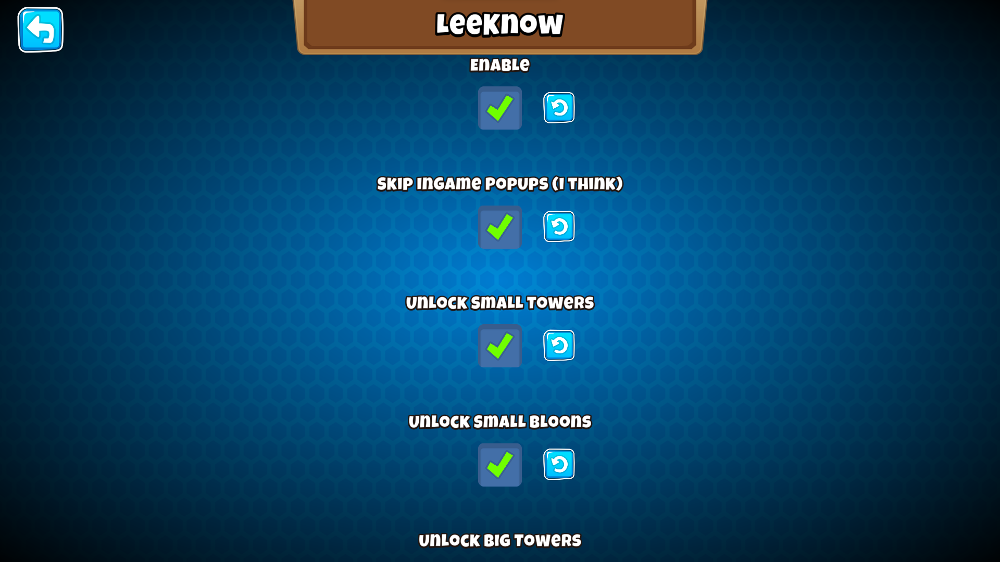

<h1 align="center">LeeKnow</h1>

### About

A BTD6 mod that makes a quick start for your new throway/modding BTD6 account.

I call it LeeKnow because of Stray Kids's LeeKnow

And because I originally intended to only get unlimited monkey knowledge but got everything instead

***This mod lets you:***

- Set Monkey Knowledge Points

- Set Monkey Money

- Unlock All Extras

- Unlimited Tower XP

- Unlimited Powers

- Set Your Profile XP and Veteran XP

### btd6.targets

Change the directory in the 4th line to your BTD6 directory

### Uh

***I dont know how to code so i got everything from:***

- https://github.com/kenx00x at [His Mods Lists](https://github.com/kenx00x/Mods/tree/Bloons_Tower_Defense_6/Mods/Bloons%20Tower%20Defense%206/Maintained)

- https://github.com/MaliciousFiles/ at [EditPlayerData](https://github.com/MaliciousFiles/EditPlayerData)

idk if i was allowed to do so, there are these license things out there and shit

i am just saving this to github because it looks fancy and bcz its telling me too everywhere i look

and to learn and also to save it ofc ( dont sue me i am just a kid )

